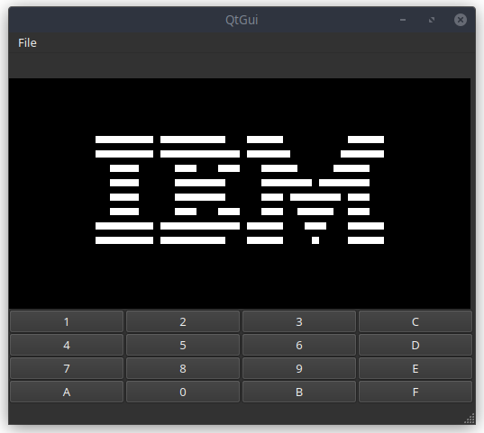

# Chip8 Emulator

This is a Chip8 emulator written in C++ with the Qt framework. The emulator allows you to play classic Chip8 games on your computer.



## Getting Started

To get started with the emulator, you will need to have Qt installed on your computer. You can download the latest version of Qt from the official website.
You will need conan too in order to compile this code. Once you have Qt and conan installed, you can download the source code for the emulator from this repository. 
To compile the emulator, run the following code:

```bash
$ cmake . -Bbuild -DCMAKE_BUILD_TYPE=Release
$ cmake --build build --target  chip8_qt

# to run the chip8_qt
$ ./build/Release/output/chip8_qt
```

# Features

Currently, the emulator has the following features:

* Tries to emulate old hardware times per opcode.
* Recognizes the default opcodes

In the future:

* Ability to change CPU speed
* Ability to change memory
* Ability to pause the executions

# Contributions

Contributions to the emulator are welcome! If you find a bug or have a feature suggestion, please open an issue on this repository. If you would like to contribute code to the emulator, please create a pull request.

# License

This emulator is licensed under the MIT License.


### Note
Part of this readme was generated by chatGPT!